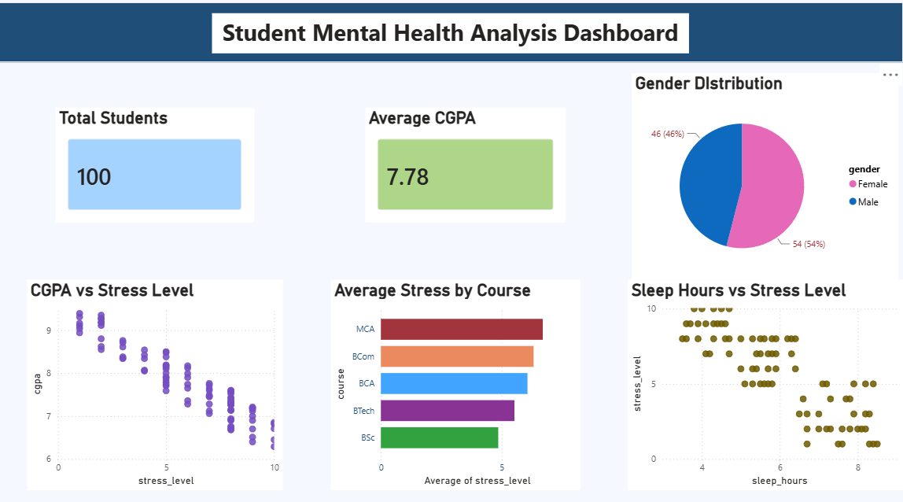

#  Student Mental Health Analysis

A data analytics project that explores the relationship between student mental health, sleep patterns, stress levels, and academic performance using MySQL and Power BI.

---

##  Project Overview

Student mental health has a significant impact on academic success. This project analyzes student data to identify trends and relationships between:

* Stress Levels
* Anxiety Levels
* Depression Levels
* Sleep Hours
* CGPA (Academic Performance)
* Gender Distribution
* Course-wise Mental Health Trends

The project combines SQL-based data analysis with Power BI visualizations to generate meaningful insights.

---

##  Objectives

* Analyze student mental health data using SQL.
* Understand the relationship between sleep and stress.
* Examine how stress affects CGPA.
* Compare stress levels across different courses.
* Build an interactive Power BI dashboard.

---

##  Tools & Technologies

| Tool        | Purpose                   |
| ----------- | ------------------------- |
| MySQL       | Data Storage & Analysis   |
| Power BI    | Dashboard & Visualization |
| GitHub      | Project Hosting           |
| CSV Dataset | Source Data               |

---

## 📂 Project Structure

student-mental-health-analysis/
│
├── data/
│   └── student_mental_health_100_records_clean.csv
│
├── sql/
│   ├── create_tables.sql
│   └── analysis_queries.sql
│
├── dashboard/
│   └── Mental_Health_Dashboard.pbix
│
├── screenshots/
│   └── dashboard_overview.png
│
├── report/
│   └── Student_Mental_Health_Analysis_Report.md
│
└── README.md


## Dataset Description

The dataset contains information about 100 students.

### Features

| Column           | Description             |
| ---------------- | ----------------------- |
| student_id       | Unique Student ID       |
| gender           | Male/Female             |
| course           | Student Course          |
| cgpa             | Academic Performance    |
| stress_level     | Stress Score (1–10)     |
| anxiety_level    | Anxiety Score (1–10)    |
| depression_level | Depression Score (1–10) |
| sleep_hours      | Daily Sleep Hours       |


##  Database Schema

### Table Creation

```sql
CREATE TABLE student_mental_health (
    student_id INT PRIMARY KEY,
    gender VARCHAR(10),
    course VARCHAR(50),
    cgpa DECIMAL(3,2),
    stress_level INT,
    anxiety_level INT,
    depression_level INT,
    sleep_hours DECIMAL(3,1)
);
```

---

##  SQL Analysis

### 1. Gender Distribution

```sql
SELECT gender, COUNT(*) AS total_students
FROM student_mental_health
GROUP BY gender;
```

### 2. Average CGPA

```sql
SELECT ROUND(AVG(cgpa),2) AS avg_cgpa
FROM student_mental_health;
```

### 3. Course-wise Stress Analysis

```sql
SELECT course,
ROUND(AVG(stress_level),2) AS avg_stress
FROM student_mental_health
GROUP BY course;
```

### 4. Sleep vs Stress Analysis

```sql
SELECT
CASE
WHEN sleep_hours < 6 THEN 'Low Sleep'
ELSE 'Normal Sleep'
END AS sleep_category,
ROUND(AVG(stress_level),2) AS avg_stress
FROM student_mental_health
GROUP BY sleep_category;
```

### 5. CGPA vs Stress Analysis

```sql
SELECT
stress_level,
ROUND(AVG(cgpa),2) AS avg_cgpa
FROM student_mental_health
GROUP BY stress_level
ORDER BY stress_level;
```

---

##  Power BI Dashboard
## Dashboard Preview



### Dashboard Components

* Total Students Card
* Average CGPA Card
* Gender Distribution Pie Chart
* Average Stress by Course Bar Chart
* Sleep Hours vs Stress Level Scatter Plot
* CGPA vs Stress Level Scatter Plot

---

## 💡 Key Insights

### Gender Distribution

* Female Students: 54%
* Male Students: 46%

### Academic Performance

* Average CGPA: 7.78

### Stress Analysis

* Average Stress Level: 5.90
* MCA students showed higher average stress levels.

### Sleep & Stress Relationship

* Students with fewer sleep hours generally experienced higher stress levels.

### Stress & Academic Performance

* Higher stress levels were associated with lower CGPA.

---

## Future Improvements

* Collect real-world survey data.
* Increase dataset size.
* Build predictive machine learning models.
* Develop a web-based analytics platform.
* Integrate real-time student wellbeing monitoring.

---

## Author

**Mansi Sharma**

GitHub:
https://github.com/sharma-mansi711

Project Repository:
https://github.com/sharma-mansi711/student-mental-health-analysis
